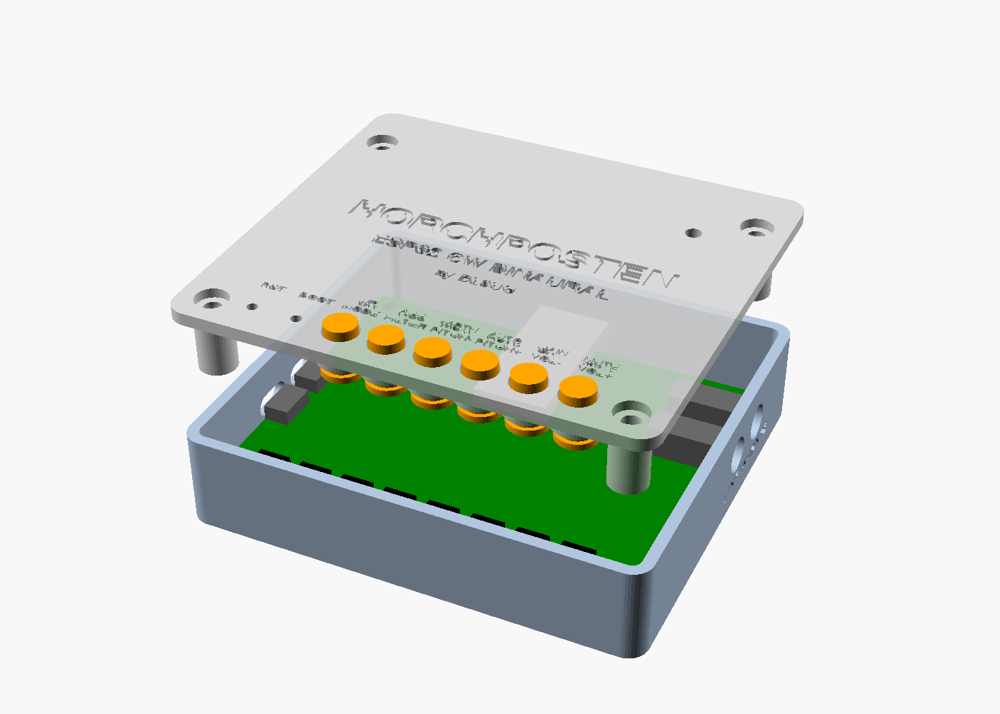
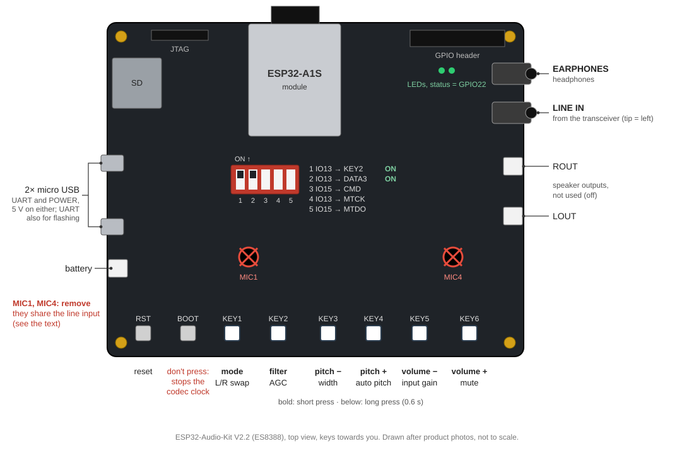

# Horchposten – ESP32 CW Binaural

Binaural CW headphone processor for the ESP32-Audio-Kit (ESP32-A1S).
The audio of a CW transceiver goes into the LINE IN jack; Horchposten
spreads the signals over the stereo image of your headphones, so stations
at different pitches appear at different places and the wanted signal
stands out of the noise.



> **Status:** work in progress. Signal chain tested on the PC
> (host tests), firmware builds; not yet tested on the hardware.

## Contents

- [Features](#features)
- [Hardware](#hardware)
- [Wiring](#wiring)
- [Keys](#keys)
- [Modes](#modes)
  - [Binaural by pitch](#binaural-by-pitch)
  - [Binaural 90 degrees](#binaural-90-degrees)
  - [Haas](#haas)
  - [Mono](#mono)
- [Filter, AGC and auto pitch](#filter-agc-and-auto-pitch)
- [Flashing](#flashing)
- [Building from source](#building-from-source)
- [Enclosure](#enclosure)
- [Feedback](#feedback)
- [License](#license)
- [Credits](#credits)

## Features

- Four listening modes: binaural by pitch, binaural 90°, Haas, mono
- CW band pass around the centre pitch: off / 500 / 250 / 100 Hz
  (Butterworth, 8th order)
- AGC for strong and weak signals, soft limiter protects the ears
- Auto pitch: one key press sets the centre pitch to the strongest tone
- All settings on six keys, kept over power off
- Codec detection: ES8388 (Audio Kit V2.2) and AC101 boards
- 3D printable enclosure (OpenSCAD, parametric)

## Hardware

- ESP32-Audio-Kit with the ESP32-A1S module (AI-Thinker), V2.2 with
  ES8388 codec; the older AC101 variant is supported but untested
- Headphones (stereo, of course)
- Cable from the transceiver's headphone or line output to the LINE IN jack
- Power over the micro USB socket "POWER" (or "UART", which is also used
  for flashing)

The speaker outputs of the board stay off.



**Remove the on-board microphones.** They share the codec input with the
LINE IN jack, and a plug in the jack does not cut them off: on a V2.2
board marked A618, tapping a microphone reached −8 dBFS, louder than a
line signal from a PC, and speech in the room came through. Desolder
both, or cut one leg of each (the one not on the ground plane); then a
tap stays below −45 dBFS. Don't bridge their legs instead: that may
short the line input to ground as well.

## Wiring

```
Transceiver            ESP32-Audio-Kit
phones / line out ---> LINE IN  (3.5 mm, tip = left channel is used)
                       PHONES   ---> headphones
                       USB      ---> 5 V
```

- A mono plug works: only the tip (left channel) is used.
- Start with the transceiver's volume low and raise it until the AGC
  holds the level; with AGC off, raise the input gain (KEY5 long) instead.
- If the transceiver has a fixed line output (ACC, data port), use it:
  then the transceiver's volume knob doesn't matter.

## Keys

| Key | Short press | Long press (0.6 s) |
|---|---|---|
| KEY1 | mode: pitch → 90° → Haas → mono | swap left / right |
| KEY2 | filter: off → 500 → 250 → 100 Hz | AGC on / off |
| KEY3 | centre pitch −25 Hz | stereo width: narrow → medium → wide |
| KEY4 | centre pitch +25 Hz | auto pitch |
| KEY5 | volume − | input gain: 0 → 6 → … → 24 dB |
| KEY6 | volume + | mute on / off |

The green LED confirms with short blinks (e.g. the number of the new mode);
one long blink means "not possible" (end of a range, auto pitch found no
clear tone). Every change is also printed in the serial log. Settings are
saved 3 s after the last change; the audio fades out for about 50
milliseconds while the flash is written. Mute is not kept, Horchposten
always starts unmuted.

Centre pitch range: 300–1000 Hz, default 600 Hz. Tip: set it to the CW
pitch of your transceiver, then your own sidetone and a station zero-beat
by the transceiver are in the middle.

KEY2 shares GPIO13 with the SD card and JTAG. If it doesn't react, check
the DIP switch next to the SD slot.

## Modes

### Binaural by pitch

The main mode. A signal exactly on the centre pitch is in the middle of
your head; lower tones move to the left, higher ones to the right. Several
stations in the passband are spread over the stereo image instead of
lying on top of each other.

How: the signal is split into I and Q (90° apart, Hilbert transformer);
one ear gets the signal, the other the same signal delayed by D and
turned back by the phase of the centre pitch. The phase between the ears
is then 2π (f − f<sub>centre</sub>) D: zero on the centre pitch, growing
with the distance from it. This follows the idea of Rick Campbell's (KK7B)
binaural I/Q receivers, but keeps the pitch of each tone.
The width (KEY3 long) sets D: 90° between the ears is reached 500 Hz
(narrow), 310 Hz (medium) or 200 Hz (wide) away from the centre pitch.

### Binaural 90 degrees

Left and right ear are 90° apart at every frequency. Noise sounds wide and
diffuse, a CW signal stays focussed and seems to stand in front of the
noise.

### Haas

One ear gets the signal some milliseconds later (8 / 15 / 25 ms, by
width). A broad, spacious sound.

### Mono

Both ears the same, for comparison.

## Filter, AGC and auto pitch

- **Filter** (KEY2): band pass centred on the centre pitch. It follows
  every change of the pitch.
- **AGC** (KEY2 long): 3 ms look-ahead, so the first element after a
  pause is no louder than the rest; 150 ms hang, slow decay. Keeps the
  level between weak and strong signals over up to about 35 dB.
- **Auto pitch** (KEY4 long): listens for 0.3 s and sets the centre pitch
  to the strongest tone between 300 and 1000 Hz, if it stands at least
  14 dB above the noise 20–60 Hz beside it. This also works behind a
  narrow CW filter in the transceiver.

## Flashing

Each [release](https://github.com/DL8UG/Horchposten-ESP32-CW-Binaural/releases) has `horchposten-vX.Y.Z-merged.bin`, one
image for address 0x0:

```sh
pip install esptool
esptool.py --chip esp32 --port /dev/ttyUSB0 write_flash 0x0 horchposten-vX.Y.Z-merged.bin
```

Use the micro USB socket "UART". If the board doesn't enter the download
mode by itself, hold BOOT and press RST. The browser tool
[ESP Tool](https://espressif.github.io/esptool-js/) works too.

## Building from source

ESP-IDF v5.5:

```sh
cd firmware
idf.py set-target esp32
idf.py build flash monitor
```

`idf.py menuconfig` → "Horchposten": codec (auto / fixed), input channel,
LED polarity.

The signal chain (`firmware/main/dsp.c`, `pitch.c`) is plain C and is
tested on the PC:

```sh
make -C firmware/test/host       # checks
make -C firmware/test/host wav   # plus WAV files to listen to (build/wav/, emptied first)
```

The WAV files (16 kHz stereo, listen with headphones) show each part of
the signal chain. The input files are brought to the level of the
processed ones, so loudness doesn't decide the comparison:

| Files | What to listen for |
|---|---|
| `01`–`05` pile-up | three CW stations (480, 600, 760 Hz) in noise: the input, then mono, pitch, 90° and Haas |
| `06`–`07` width | pitch mode narrow / wide on the same pile-up (medium is the default: `03`) |
| `08`–`10` filter | pitch mode with 500 / 250 / 100 Hz |
| `11` sweep | one tone gliding from 300 to 1000 Hz: travels from left to right, in the middle at 600 Hz |
| `12`–`14` AGC | weak station, a very strong one, weak again: the input, AGC on, AGC off |
| `15` changes | a setting changed every 1.5 s on the pile-up (list in `15_changes.txt`); the checks run the same changes on a clean tone and fail on any click |

## Enclosure

A parametric 3D printable enclosure is in [case/](case/README.md). It is
a **draft**: not printed or tested yet, but a solid base for your own
design. Measure your board before printing; the README there says what to
measure.

## Feedback

Please open a [GitHub issue](https://github.com/DL8UG/Horchposten-ESP32-CW-Binaural/issues) – with the firmware version and
codec from the serial log, your transceiver, and what you did.

## License

Beerware, see [LICENSE](LICENSE).

## Credits

- Binaural I/Q reception: Rick Campbell, KK7B
- Hilbert transformer (allpass pair): Olli Niemitalo
- Board and codec details: the arduino-audiokit project by Phil Schatzmann
  and the Linux AC101 driver (respeaker/seeed-voicecard)

Developed with the help of Claude Code.
