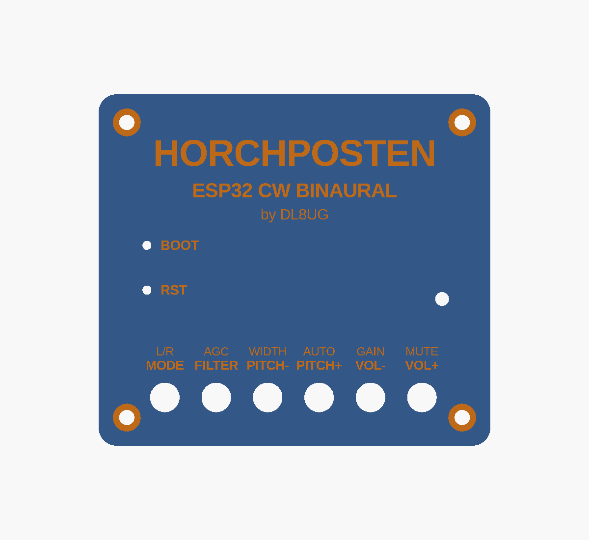

# Enclosure

Parametric enclosure for the ESP32-Audio-Kit V2.2 in OpenSCAD:
[horchposten_case.scad](horchposten_case.scad).


> The board positions in the model are **estimates**. Measure your board
> and correct the values before the first print (see [Measuring](#measuring)).

## Contents

- [Parts](#parts)
- [Measuring](#measuring)
- [Building the STL files](#building-the-stl-files)
- [Printing](#printing)
- [Assembly](#assembly)
- [Display window](#display-window)

## Parts

| Part | Count | Notes |
|---|---|---|
| `bottom` | 1 | shell with standoffs, openings for the jacks and USB, vent slots |
| `lid` | 1 | key guides, lettering, holes for RESET/BOOT and the LED |
| `buttons` | 1 set | six key plungers |
| M3 x 16 cap screws | 4 | through lid and PCB into the standoffs |
| M3 heat-set inserts | 4 | 4.0 mm hole; for self-tapping screws set `insert_d = 2.6` |
| rubber feet | 4 | 10 mm, self-adhesive |
| clear filament, 3 mm long | 1 | light pipe for the status LED (optional) |



## Measuring

All values are in the block "board (MEASURE)" at the top of the SCAD file.
Coordinates are in mm, seen from the top of the board, origin at the front
left corner of the PCB, front edge = the side with KEY1..KEY6.

| Parameter | What to measure |
|---|---|
| `pcb`, `pcb_t` | PCB size and thickness |
| `holes`, `hole_d` | centres of the four mounting holes |
| `under_h` | tallest part on the underside (solder pins) + 1 mm |
| `over_h` | tallest part on the top + 1 mm |
| `keys`, `key_top` | centre of each key; height of the key actuator above the PCB |
| `pin_holes` | centres of RESET and BOOT |
| `led` | centre of the green LED (GPIO22) |
| `ports` | for both 3.5 mm jacks and both micro USB sockets: side, position along that side, centre height above the PCB, opening size |

Check after editing: `part = "assembly"` shows the board dummy in the
shell; jacks and USB plugs must line up with the openings.

## Building the STL files

Ready STL files are in [stl/](stl/), rendered from the SCAD file with the
estimated board positions. After changing parameters, render them again:

```sh
for p in bottom lid buttons; do
  openscad -o stl/$p.stl -D "part=\"$p\"" horchposten_case.scad
done
```

The release workflow does the same and attaches a zip with the STL files
and the SCAD source to each GitHub release.

## Printing

- PLA or PETG, 0.2 mm layers, 3 walls, 20 % infill, no supports.
- `bottom` stands on its floor, `lid` comes out upside down (top face on
  the bed, the lettering is engraved into it), `buttons` stand on their
  flanges.
- Contrasting lettering: rub acrylic paint into the engraving and wipe
  the surface clean.

## Assembly

1. Press the heat-set inserts into the standoffs.
2. Put the board in, jacks first through the side openings.
3. Drop the plungers into the lid from below (flange inside), put the lid
   on and fasten it with the four screws. Don't overtighten: the lid tubes
   clamp the PCB.
4. Rubber feet into the recesses under the bottom.

## Display window

For the later display stage set `display_window = true` and give the
position and size of the window (`display_pos`, `display_size`). If the
display needs more height, raise `over_h`.
